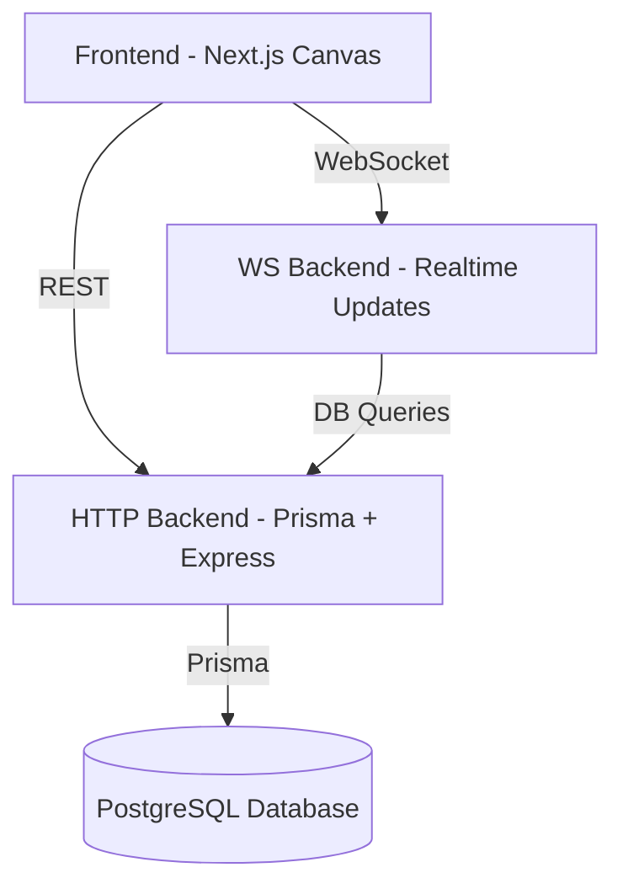

# 🎨 Draw App — Real-Time Collaborative Whiteboard

A powerful, modern real-time collaboration drawing system built using Next.js, WebSockets, Express, Prisma, and Turborepo.
Draw App allows multiple users to sketch, brainstorm, and design together instantly on a shared canvas — with persistent storage and live sync.

## 🚀 Features

✏️ Drawing Tools
Rectangle, Circle, Diamond
Pencil
Arrow
Text
Image insertion
Eraser
Undo / Redo (coming soon)
⚡ Real-Time Collaboration
WebSocket-powered live drawing sync
Multi-user rooms
JWT-authenticated WebSocket connection
Cursor-based interactions (optional extension)
🗄️ Reliable Persistence
All drawing operations are saved in PostgreSQL
Prisma-backed ORM
Efficient loading of existing shapes on room join
🧩 Modular Architecture
Turborepo-based monorepo
Shared backend utilities
Clean separation of concerns

```sh
npx create-turbo@latest
```

## 🌐 Live Architecture Overview




## 🏗️ Project Structure

```text
.
├── apps
│   ├── frontend        → Next.js 15 collaborative canvas UI
│   ├── http-backend    → Express API (Prisma CRUD)
│   └── ws-backend      → WebSocket real-time sync server

├── packages
│   ├── db              → Prisma schema + generated client
│   ├── ui              → Shared UI components
│   └── backend-common  → Shared env + constants + JWT secret
└── turbo.json


```


### 💬 WebSocket Message Examples
Join Room
{
  "type": "join_room",
  "roomId": "abc-123"
}

Send Shape Event
{
  "type": "chat",
  "roomId": "abc-123",
  "message": "{"shape": {...}}"
}

### 📦 Tech Stack
Frontend
Next.js 15
React 19
Tailwind CSS
Canvas API
Framer Motion
Backend
Express.js
WS WebSocket Server
Prisma ORM
PostgreSQL

Turborepo
pnpm workspaces


## 📎 Screenshots

UI Overview


